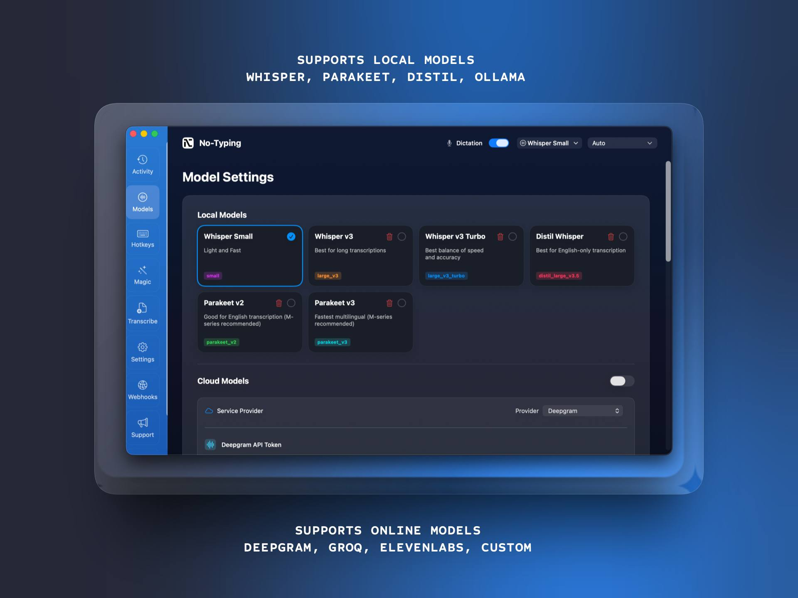
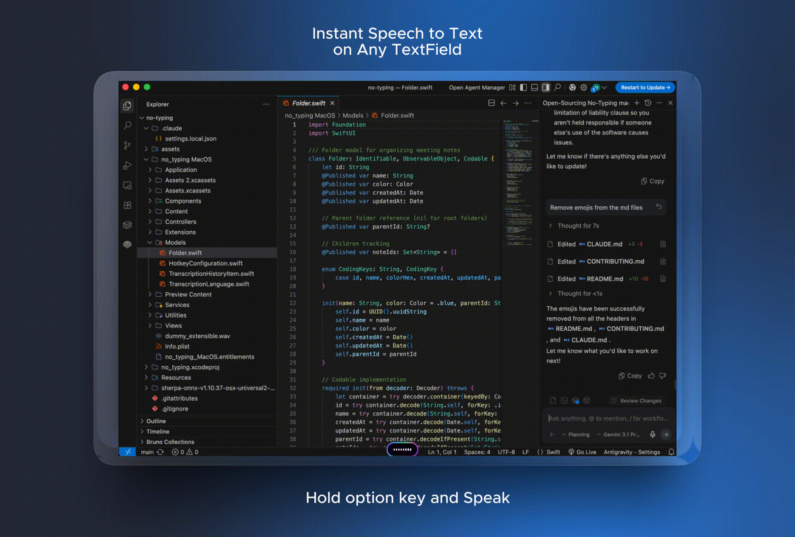

<div align="center">
  
  
  # No-Typing - Open Source Speech-to-Text for macOS
</div>

[No-Typing](https://www.no-typing.com) is a powerful, open-source macOS application that provides fast speech-to-text transcription. Replace typing with natural speech - just hold down a hotkey, speak, and watch your words appear instantly. It supports both **Local, privacy-first Transcription** via Whisper, and **Lightning-fast Cloud Transcription** via top providers.

## Why No-Typing?
- **100% Transparent**: Unlike some alternatives, No-Typing is fully open-source. You know exactly how your audio is handled.
- **Privacy First**: Your data remains yours. Inspect the codebase freely, and rest easy knowing No-Typing doesn't harvest your data. Use local models for air-gapped security, or your own secure API keys for cloud providers.
- **Free & Community Driven**: Built for the community, by the community. No hidden costs.

## Features

- System-wide dictation using Whisper (replaces Apple’s dictation)
- Record directly from your microphone or any input device on your Mac
- All transcription runs locally — no data leaves your machine
- Metal and GPU acceleration for extremely fast transcription
- Up to **~50× realtime transcription speed**
- Support for **Parakeet v3** (up to **500× realtime transcription**) on M-series Macs
- Supports **100+ languages**
- Select transcription language or use auto-detect
- Supports Cloud Model integration (using your own API key)
- Translate transcripts using **DeepL API and Top AI providers**
- Automatically remove filler words (ums, uhhs, etc.)
- Ignore segments such as `[SILENCE]`, `[BLANK_AUDIO]`, `[NOISE]` in transcripts

- AI text rewriting integrations:
  - OpenAI (ChatGPT)
  - Anthropic (Claude)
  - Google (Gemini)
  - Deepseek
  - Many more...

- Cloud transcription support via:
  - OpenAI
  - ElevenLabs
  - Deepgram
  - Groq
  - Custom API

- Whisper model support:
  - Base
  - Small
  - Large (v3, Turbo)
  - Custom supported model link

- Parakeet model support:
  - Parakeet (v2, v3)

- Distil-Whisper model support:
  - Distil-Whisper (v3.5)

- Supports GPT models:
  - GPT-4
  - GPT-4 Turbo
  - GPT-4o
  - GPT-4o-mini
  - Legacy models

- Integrations enabled via Custom Webhooks (Send transcripts to your own pipeline):
  - Make.com
  - n8n
  - Zapier
  - Custom Webhooks, etc.

- Additional AI & Cloud integrations (via Custom Endpoints/Servers):
  - Ollama
  - XAI
  - Azure AI models
  - Custom OpenAI compatible endpoints
  - Custom Whisper servers

- Record and transcribe audio files directly on your Mac
- Automatic spelling, punctuation, and grammar correction in dictation mode
- Transcribe videos from **YouTube, TikTok, Instagram, Facebook, and Vimeo**
- Transcribe podcasts by combining single-track audio for each host (beta)

## Upcoming Features (Planned)

- Full text and speaker search across all transcripts
- Automatically record meetings from Zoom, Teams, Webex, Skype, Chime, Discord, and more
- Export transcripts as `.whisper` files (includes original audio and edits for sharing)
- Export subtitles (`.srt`, `.vtt`) and documents (`csv`, `docx`, `pdf`, `markdown`, `html`)
- Search entire transcript and highlight words
- Copy full transcript or selected sections
- Star / favorite transcript segments
- Compact mode (hide timestamps)
- Drag and drop audio directly from Voice Memos
- Edit and delete transcript segments
- Add up to two speakers manually / Automatic speaker recognition
- Change starting timestamp for transcripts
- Audio playback synced with transcripts
- View multiple subtitle languages simultaneously
- Batch transcription for processing multiple files sequentially
- Record and transcribe **system audio** (e.g., meetings)
- Realtime captions and subtitles with **live translation** (microphone or system audio)
- Watch Folder automation to auto-transcribe files added to a directory
- Add custom **GGML models**
- Translate audio into another language using Whisper
- Translate subtitles into multiple languages

## Installation

### Download Pre-built App
1. Download latest version from [no-typing.com](https://www.no-typing.com)
2. Open the DMG and drag No-Typing to your Applications folder.
3. The app is currently unsigned. On first launch, macOS will block it. Go to **System Settings → Privacy & Security**, scroll down, and click **"Open Anyway"** to allow No-Typing to run.
4. Launch No-Typing and follow the onboarding wizard to grant the necessary Microphone and Accessibility permissions.

### Build from Source
```bash
git clone https://github.com/no-typing/no-typing-mac.git
cd no-typing-mac
open "no_typing.xcodeproj"
```
Select the `no_typing MacOS` scheme in Xcode, choose your local Mac as the run destination, and hit `⌘R`.


<br>



## Contributing
We love our open-source community! Whether you want to fix a bug, add a new cloud provider, or improve the UI, please see our [CONTRIBUTING.md](CONTRIBUTING.md) for details on how to set up your development environment and submit pull requests.

## Acknowledgments
- [OpenAI Whisper](https://github.com/openai/whisper) 
- [whisper.cpp](https://github.com/ggerganov/whisper.cpp) for the efficient C++ implementation
- [Gideon Ogbonna](https://www.giddynaya.com) (Creator of No-Typing)
- [Learn more about No-Typing](https://www.no-typing.com) 

## License
No-Typing is released under the MIT License. See the LICENSE file for details.